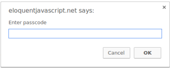
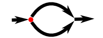
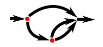
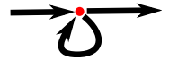

Programming is the act of constructing a program—a set of precise instructions telling a computer what to do.

# 1. Values, Types, and Operators

## 1.1 Arithmetic

When operators appear together without parentheses, the order in which they are applied is determined by the precedence of the operators.

The ``/`` operator has the same precedence as ``*``. Likewise for ``+`` and ``-``. When multiple operators with the same precedence appear next to each other, as in **1 - 2 + 1**, they are applied left to right: **(1 - 2)+ 1**.

The ``%`` symbol is used to represent the remainder operation. ``X % Y`` is the remainder of dividing X by Y. For example, 

    314 % 100   // →  14
    144 % 12    // →  0

The remainder operator’s precedence is the same as that of multiplication and division. You’ll also often see this operator referred to as modulo.

## 1.2 Special numbers

There are three special values in JavaScript that are considered numbers but don’t behave like normal numbers.

The first two are ``Infinity`` and ``-Infinity``,  which represent the positive and negative infinities.

It isn’t mathematically sound, and it will quickly lead to the next special number: ``NaN``. **NaN** stands for **“not a number”**.

## 1.3 Strings

They are written by enclosing their content in quotes.

You can use single quotes, double quotes, or backticks to mark strings, as long as the quotes at the start and the end of the string match.

#### 1.3.1 Backslash

Whenever a backslash ``\`` is found inside quoted text, it indicates that the character after it has a special meaning. This is called escaping the character

    "This is the first line\nAnd this is the second"

        The actual text contained is this:
    
    This is the first line And this is the second

If two backslashes follow each other, they will collapse together, and only one will be left in the resulting string value.

    "A newline character is written like \"\\n\"."

Strings, too, have to be modeled as a series of bits to be able to exist inside the computer. The way JavaScript does this is based on the Unicode standard.

#### 1.3.2 Concatenation

Strings cannot be divided, multiplied, or subtracted, but the ``+`` operator can be used on them. It does not add, but it concatenates—it glues two strings together. The following line will produce the string **"concatenate"**:

    "con" + "cat" + "e" + "nate"

#### 1.3.3 Backtick-quoted strings

Usually called template literals, can do a few more tricks. Apart from being able to span lines, they can also embed other values.

    `half of 100 is ${100 / 2}`

When you write something inside ``${}`` in a template literal, its result will be computed, converted to a string, and included at that position

    `half of 100 is ${100 / 2}`     // →  half of 100 is 50

## 1.4 Unary operators

#### 1.4.1 typeof

One example is the ``typeof`` operator, which produces a string value naming the type of the value you give it.

    console.log(typeof 4.5)     // → number
    console.log(typeof "x")     // → string

#### 1.4.2 minus (-)

Operators that use two values are called binary operators, while those that take one are called unary operators. The minus operator can be used both as a binary operator and as a unary operator.

    console.log(- (10 - 2))     // → -8

## 1.5 Boolean values

It is often useful to have a value that distinguishes between only two possibilities, like “yes” and “no” or “on” and “off”.

#### 1.5.1 Comparison

The ``>`` and ``<`` signs are the traditional symbols for “is greater than” and “is
less than”, respectively. They are binary operators.

    console.log(3 > 2)  // → true
    console.log(3 < 2)  // → false

Strings can be compared in the same way.

    console.log("Aardvark" < "Zoroaster")   // → true

When comparing strings, JavaScript goes over the characters from left to right, comparing the Unicode codes one by one.

Other similar operators are ``>=`` (greater than or equal to), ``<=`` (less than or equal to), ``==`` (equal to), and ``!=`` (not equal to).

    console.log("Itchy" != "Scratchy")  // → true
    console.log("Apple" == "Orange")    // → false

There is only one value in JavaScript that is not equal to itself, and that is ``NaN`` (“not a number”).

    console.log(NaN == NaN)     // → false

``NaN`` is supposed to denote the result of a nonsensical computation, and as such, it isn’t 
equal to the result of any other nonsensical computations.

#### 1.5.2 Logical operators

JavaScript supports three logical operators: and, or, and not.

The ``&&`` operator represents logical and. It is a binary operator, and its result is true only if both the values given to it are true.

    console.log(true && false)  // → false
    console.log(true && true)   // → true

The ``||`` operator denotes logical or. It produces true if either of the values given to it is true.

    console.log(false || true)      // → true
    console.log(false || false)     // → false

|| has the lowest precedence, then comes &&, then the comparison operators (>, ==, and so on), and then the rest.

The last logical operator I will discuss is not unary, not binary, but **ternary**, operating on three values. It is written with a question mark and a colon, like this:

    console.log(true ? 1 : 2);      // → 1
    console.log(false ? 1 : 2);     // → 2

The value on the left of the question mark “picks” which of the other two values will come out. When it is true, it chooses the middle value, and when it is false, it chooses the value on the right.

## 1.6 Empty values

There are two special values, written ``null`` and ``undefined``, that are used to denote the absence of a meaningful value

Many operations in the language that don’t produce a meaningful value yield ``undefined`` simply because they have to yield some value.`

## 1.7 Automatic type conversion

When an operator is applied to the “wrong” type of value, JavaScript will quietly convert that value to the type it needs, using a set of rules that often aren’t what you want or expect. **This is called type coercion.**

console.log(8 * null)       // → 0
console.log("5" - 1)        // → 4
console.log("5" + 1)        // → 51
console.log("five" * 2)     // → NaN
console.log(false == 0)     // → true

When something that doesn’t map to a number in an obvious way (such as "five" or undefined) is converted to a number, you get the value NaN.

When comparing values of the same type using ==, the outcome is easy to predict: you should get true when both values are the same, except in the case of NaN. However, when null or undefined occurs on either side of the operator, it produces true only if both sides are one of null or undefined.

    console.log(null == undefined);     // → true
    console.log(null == 0);             // → false

But what if you want to test whether something refers to the precise value false? Expressions like **0 == false** and "**" == false** are also ``true`` because of automatic type conversion.

    console.log(0==false);      // → true
    console.log(""==false);     // → true

When you do not want any type conversions to happen, there are two additional operators: ``===`` and ``!==``. **The first tests whether a value is precisely equal to the other, and the second tests whether it is not precisely equal**.

    console.log("" === false);  // false

## 1.8 Short-circuiting of logical operators

The || operator, for example, will return the value to its left when that can be converted to true and will return the value on its right otherwise.

The logical operators && and || handle values of different types in a peculiar way. They will convert the value on their left side to Boolean type in order to decide what to do, but depending on the operator and the result of that conversion, they will return either the original left-hand value or the righthand value.

The ``||`` operator, for example, will return the value to its left when that can
be converted to true and will return the value on its right otherwise.

    console.log(null || "user")     // → user
    console.log("Agnes" || "user")  // → Agnes

The rules for converting strings and numbers to Boolean values state that **0, NaN, and the empty string ("") count as false**, while all the other values count as true.

    console.log(0 || -1)        // → -1
    console.log("" || "!?")     // → "!?"

The ``&&`` operator works similarly but the other way around. When the value to its left is something that converts to false, it returns that value, and otherwise it returns the value on its right.

Another important property of these two operators is that t**he part to their right is evaluated only when necessary**. In the case of ``true || X``, no matter what X is—even if it’s a piece of program that does something terrible—the result will be true, and X is never evaluated.

# 2. Program Structure

## 2.1 Expressions and statements

A statement stands on its own, so it amounts to something only if it affects the world. It could display something on the screen—that counts as changing the world—or it could change the internal state of the machine in a way that will affect the statements that come after it. These changes are called side effects.

In some cases, JavaScript allows you to omit the semicolon at the end of a statement. In other cases, it has to be there, or the next line will be treated as part of the same statement.

## 2.2 Bindings

To catch and hold values, JavaScript provides a thing called a binding, or variable:

    let caught = 5 * 5;

That’s a second kind of statement. The special word (keyword) let indicates that this sentence is going to define a binding.

After a binding has been defined, its name can be used as an expression. The value of such an expression is the value the binding currently holds.

    let ten = 10;
    console.log(ten * ten);     // → 100

When a binding points at a value, that does not mean it is tied to that value forever. The = operator can be used at any time on existing bindings to disconnect them from their current value and have them point to a new one.

    let mood = "light";
    console.log(mood);  // → light
    mood = "dark";
    console.log(mood);  // → dark

You should imagine bindings as tentacles, rather than boxes. They do not contain values; they grasp them—two bindings can refer to the same value.

    let luigisDebt = 140;
    luigisDebt = luigisDebt - 35;
    console.log(luigisDebt);    // → 105

When you define a binding without giving it a value, the tentacle has nothing to grasp, so it ends in thin air. If you ask for the value of an empty binding, you’ll get the value ``undefined``. A single let statement may define multiple bindings. The definitions must be separated by commas.

    let one = 1, two = 2;
    console.log(one + two);     // → 3

The words var and const can also be used to create bindings, in a way similar to let.

    var name = "Ayda";
    const greeting = "Hello ";
    console.log(greeting + name);   // → Hello Ayda

The first, var (short for “variable”), is the way bindings were declared in pre-2015 JavaScript. The word const stands for constant. It defines a constant binding, which points at the same value for as long as it lives.

## 2.3 Binding names

Binding names can be any word. Digits can be part of binding names but the name must not start with a digit. A binding name may include dollar signs ($) or underscores (_) but no other punctuation or special characters. Words with a special meaning, such as let, are keywords, and they may not be used as binding names. There are also a number of words that are “reserved for use”.

## 2.4 The environment

The collection of bindings and their values that exist at a given time is called the environment. When a program starts up, this environment is not empty.

For example, in a browser, there are functions to interact with the currently loaded website and to read mouse and keyboard input.

## 2.5 Functions

A lot of the values provided in the default environment have the type function. A function is a piece of program wrapped in a value.

The binding prompt holds a function that shows a little dialog box asking for user input.

    prompt("Enter passcode");

You can call a function by putting parentheses after an expression that produces a function value. Usually you’ll directly use the name of the binding that holds the function. The values between the parentheses are given to the program inside the function.

Values given to functions are called arguments. Different functions might need a different number or different types of arguments.

## 2.6 The console.log function

In browsers, the output lands in the JavaScript console. This part of the browser interface is hidden by default, but most browsers open it when you press F12 or, on a Mac, command-option-I.

Though binding names cannot contain period characters, console.log does have one. This is because console.log isn’t a simple binding. It is actually an expression that retrieves the log property from the value held by the console binding.

## 2.7 Return values

**Showing a dialog box or writing text to the screen is a side effect.**
Functions may also produce values, in which case they don’t need to have a side effect to be useful. For example, the function Math.max takes any amount of number arguments and gives back the greatest.

    console.log(Math.max(2, 4));    // → 4

When a function produces a value, it is said to return that value. Anything that produces a value is an expression in JavaScript, which means function calls can be used within larger expressions.

## 2.8 Control flow

When your program contains more than one statement, the statements are executed as if they are a story, from top to bottom.

> **The function Number converts a value to a number. There are similar functions called String and Boolean that convert values to those types.**

Here is the rather trivial schematic representation of straight-line control flow:

## 2.9 Conditional execution

Not all programs are straight roads. We may, for example, the program takes the proper branch based on the situation at hand. This is called conditional execution.

Conditional execution is created with the if keyword in JavaScript. In the simple case, we want some code to be executed if, and only if, a certain condition holds.

    let theNumber = Number(prompt("Pick a number"));
    if (!Number.isNaN(theNumber)) {
        console.log("Your number is the square root of " + theNumber * theNumber);
    }

The Number.isNaN function is a standard JavaScript function that returnstrue only if the argument it is given is ``NaN``. The Number function happens to return ``NaN`` when you give it a string that doesn’t represent a valid number.

The statement after the if is wrapped in braces ({ and }) in this example. The braces can be used to group any number of statements into a single statement, called a block.

You can use the else keyword, together with if, to create two separate, alternative execution paths.

    let theNumber = Number(prompt("Pick a number"));
    if (!Number.isNaN(theNumber)) {
        console.log("Your number is the square root of " + theNumber * theNumber);
    } else {
        console.log("Hey. Why didn't you give me a number?");
    }

If you have more than two paths to choose from, you can “chain” multiple if/else pairs together.

    let num = Number(prompt("Pick a number"));
    if (num < 10) {
        console.log("Small");
    } else if (num < 100) {
        console.log("Medium");
    } else {
        console.log("Large");
    }

The schema for this program looks something like this:

## 2.10 while and do loops

When we need to run a piece of code multiple times. This form of control flow is called a loop.

Looping control flow allows us to go back to some point in the program wherewe were before and repeat it with our current program state.

