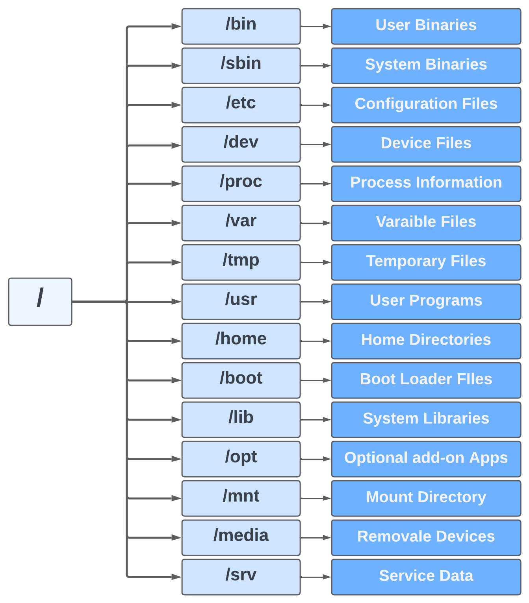
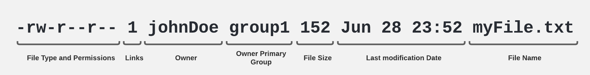

When a shell is used interactively, it displays a string when it is waiting for a command from the user. This is called 
the shell prompt. When a regular user starts a shell, the default prompt ends with a 
$ character, as shown below. 
            
    [user@rhel8 ~]$

---

# Commands

### File Management

- #### [cat](./Commands/File/cat.md)
- #### [cp](./Commands/File/cp.md)
- #### [file](./Commands/File/file.md)
- #### [head](./Commands/File/head.md)
- #### [less](./Commands/File/less.md)
- #### [ll](./Commands/File/ll.md)
- #### [tail](./Commands/File/tail.md)
- #### [touch](./Commands/File/touch.md)
- #### [vim](./Commands/File/vim.md)

### Direcotory Management

- #### [cd](./Commands/Directory/cd.md)
- #### [mkdir](./Commands/Directory/mkdir.md)
- #### [mv](./Commands/Directory/mv.md)
- #### [pwd](./Commands/Directory/pwd.md)

### User Management

|Command|Argument|Action|Example|
|-------|--------|------|-------|
|useradd|user-name|*Create a new user*|```useradd user1```|
|passwd|user-name|*Change the selected user's password*|```passwd user1```|
|su| - user-name| *Switch of user. Type exit to LogOut*|```su - user1```|
|whoami||*Displays the current username*| ```whoami```|

---

### Other

- #### [history](./Commands/Others/history.md)

---

# Estructura del sistema de archivos




---

# Tipos de archivos

Se pueden identificar por el primer caracter con comando **ls -ld file**.

- **-** : Regular File
- **d** : Directory
- **c** : Character device file
- **b** : Block device file
- **s** : Local socket file
- **p** : Named pipe
- **l** : Symbolic link

#### Regular File 

Es el tipo mas común que se puede encontrar en el sistema Linux. Pueden considerarse arcivos comunes archivos de texto, imagenes, archivos binarios, librerias compartidas, etc. Se pueden crear archivos regulares con el comando **touch**.

    -rw-rw-r--

#### Directory

Es el segundo más comun el sistema Linux. Pueden crearse directorios con el comando **mkdir**.

    drwxrwxr-x

#### Character device

Permiten a los usuarios y programas a comunicarse con dispositivos perifericos de hardware.

    crw--------

#### Block device

Son similares a los archivos de tipo Character Device, con la diferencia que generalmente controlan el disco duro, memoria, etc.

    brw-rw-----

#### Local domain Sockets

Son usados para la comunicacion entre los procesos. Generalmente, son usados por servicios como X windows, syslog, etc. Puede ser creados por una llamada al socket system y eliminados por el **unlink** o comandos **rm**.

    srw-rw-rw-

#### Named Pipes

Similares a los Local Sockets, permiten la comunicacion entre dos procesos locales. Pueden ser creados con el comando **mknod** y removidos con el comando **rm**.

#### Symbolic Links

    lrwxrwxrwx


---

# Links

En UNIX un link es un puntero hacia un archivo.

#### Soft Links

Es un enlace que apunta al archivo original

- **¿Qué pasa si se elimina el archivo?**
    - El soft link apuntaría a nada, ya que apuntaría a un archivo inexistente.
- Puede cruzar el sistema de archivos.
- Permite vincular entre directorios.
- Tienen diferente numero de ***inodo*** y permisos que el archivo original.
- Al cambiar los permisos del archivo original, no afecta a los enalces y viceversa.

**Crear un SOFT LINK:**

    ln -s file-path soft-link-name


#### Hard Links

En un enlace que apunta a un copia del archivo original

- **¿Qué pasa si se elimina el archivo?**
    - El hard link seguiría apuntado al archivo con la informacion original, ya que es una copia exacta.
- No puede cruzar los limites del sistema de archivos.
- No se pueden enlazar directorios.
- Tienen el mismo numero de ***inodo*** y permisos que el archivo original.
- Al cambiar los permisos del archivo original los cambios también se reflejan en los enlaces.

**Crear un HARD LINK:**

    ln file-path hard-link-name

---

# Pattern matching

#### Pattern

    a*
    *a*

    [ac]

    ?

#### Tilde Expansion

Representado por el caracter ~ es utilizado para especificar el directorio **HOME** de un usuario, por ejemplo para un usuario root.

    cd ~root

Supongase el siguiente directorio para un usuario ***user1***:

<table style="font-family: FreeMono, monospace;">
    <tr>
        <td>
            <image src="./images/tildeExpansion_1.png" width="300" />
        </td>
        <td style="font-weight:bold;">
                $> cd ~user1/myFiles
                <br>
                $> ls -ltr ~user1/myFiles
        </td>
    </tr>
</table>

#### Brace Expansion

Representada por llaves { }, se podría decir que funcionan como un arreglo de datos. Algunos ejemplos:

    echo {Jan, Feb, Mar, Apr}
    > Jan Feb Mar Apr

    echo file{1..5}.txt
    > file1.txt file2.txt file3.txt file4.txt file5.txt

    echo {a..z}
    > a b c d e f g h i j k l m n o p q r s t u v w x y z

    echo {a..d}
    > a b c d

#### Variable Expansion

Funcionan como una pareja de tipo clave valor, que a su vez puede ser leidas usando el caracter $, por ejemplo

    var1=10
    var2=20
    echo $var1 $var2

---

# Manual Pages (man)

Es una interfaz usada para ver el manual de referencias del sistema. El manual tiene varaias secciones que se componen por:

    >- NAME
    >- SYNOPSIS
    >- CONFIGURATION
    >- DESCRIPTION
    >- OPTIONS
    >- EXIT STATUS
    >- RETURN VALUE
    >- ERRORS
    >- ENVIRONMENT
    >- FILES
    >- VERSIONS
    >- CONFORMING TO
    >- NOTES
    >- BUGS
    >- EXAMPLE
    >- AUTHORS
    >- SEE ALSO

> El comando **pinfo** tambien puede ser usado como alternativa para tener informacion de algun comando, por ejemplo :
    >- ``$ pinfo tar``

<table>
    <thead>
        <tr>
            <th colspan="2">Section numbers of the manual</th>
        </tr>
        <tr>
            <th>Number</th>
            <th>Section</th>
        </tr>
    </thead>
    <tbody>
        <tr>
            <td>1</td>
            <td>Executable programs or shell commands</td>
        </tr>
        <tr>
            <td>2</td>
            <td>System calls (functions provided by the kernel)</td>
        </tr>
        <tr>
            <td>3</td>
            <td>Library calls (functions within program libraries)</td>
        </tr>
        <tr>
            <td>4</td>
            <td>Special Files (usually found un /dev)</td>
        </tr>
        <tr>
            <td>5</td>
            <td>File formats and conventions example /etc/passwd</td>
        </tr>
        <tr>
            <td>6</td>
            <td>Games</td>
        </tr>
        <tr>
            <td>7</td>
            <td>Miscellaneous (including macro packages and conventions) example man(7), groff(7) </td>
        </tr>
        <tr>
            <td>8</td>
            <td>System administration commands (usually only for root)</td>
        </tr>
        <tr>
            <td>9</td>
            <td>Kernet routines [Non Standard]</td>
        </tr>
    </tbody>
</table>

**Show manual for passwd command**

    $ man passwd

**Show all the sections available for passwd command**

    $ man -k passwd

**Show specific section for command passwd**

    $ man 5 passwd

---

# Input Output Redirection

Cada procesos en Linux es proveido con 3 archivos abiertos (open files, usualmente llamados archivo descriptores). Estos archivos son **standard input**, **standard output** y **standard error**.

Un descriptor de archivo es simplemente un numero que hace referencia a un archivo abierto (open file).

- **0**: Hace referencia a **Standard Input**.
- **1**: Hace referencia a **Standard Output**.
- **2**: Hace referencia a **Standard Error**.

#### Channels (File Descriptors)

<table>
    <thead>
        <th>Number</th>
        <th>Channel</th>
        <th>Name</th>
        <th>Description</th>
        <th>Default Connection</th>
    </thead>
    <tbody>
        <tr>
            <td>0</td>
            <td>stdin</td>
            <td>Standard</td>
            <td>input</td>
            <td>Keyborad</td>
        </tr>
        <tr>
            <td>1</td>
            <td>stdout</td>
            <td>Standard</td>
            <td>output</td>
            <td>Terminal</td>
        </tr>
        <tr>
            <td>2</td>
            <td>stderr</td>
            <td>Standard</td>
            <td>error</td>
            <td>Terminal</td>
        </tr>
        <tr>
            <td>3+</td>
            <td>filename</td>
            <td>Other</td>
            <td>files</td>
            <td>none</td>
        </tr>
    </tbody>
</table>

#### Standard Input

Abreviado como stdin, en la data o programa de entrada (input). Por defecto es cualquier texto ingresado desde el teclado.

#### Standard Output

Abreviado como stdout. Su destino por defecto es generalmente la pantalla, pero puede ser redirigido.

Para atrapar el output dentro de un archivo se usa el caracter **>** apuntado hacia el nombre del archivo, en caso de que el archivo ya exista usar el caracter 2 veces **>>** para que agregue el contenido, por ejemplo:

    $ ls > myFile.txt
    $ ls >> myFile.txt
    

#### Standard Error

Abreviado como stderr. Programas de linea de comandos envian mensajes de error al usuario a traves del standard error.

Para atrapar el error dentro de un archivo se usa el caracter **>** siendo precedido por el numero del canal para este caso el 2 (ver la tabla anterior), **2>** apuntando hacia el nombre del archivo, en caso de que el archivo ya exista usar el caracter 2 veces **2>>** para que agregue el contenido, por ejemplo:

    $ comandoInexistente 2> myFile.txt
    $ comandoInexistente 2>> myFile.txt

Suponiendo que el archivo **script.sh** sea un ejecutable, se puede capturar el **stdout** y **stderr** dentro de un archivo con la combinacion de caracteres **&>** y para agregar los resultados a un archivo ya existente usar **&>>**.

    $ script.sh &> myFile.txt
    $ (ls && comandoInexistente) &> myFile.txt
    $ (ls && comandoInexistente) &>> hola

O tambien usando la combinacion **>** seguido del nombre del archivo **2>&1**

    $ script.sh > myFile.txt 2>&1
    $ (ls && comandoInexistente) > myFile.txt 2>&1

    $ script.sh >> myFile.txt 2>&1
    $ (ls && comandoInexistente) >> myFile.txt 2>&1

---

# Pipelines

Los pipes son usados para combinar 2 o más comandos. La salida (output) de un comando actua como la entrada (input) del siguiente y asi hasta llegar al último comando.

    command1 | command2 | command3 |...| commandN

Por ejemplo:

    $ ls -ltr | less
    $ ls | wc -l
    $ ls -ltr | head -n 10
    $ ls -ltr | tail -n 10

### tee command

Es utilizado para crear archivos a partir de la salida de un pipeline, como se muestra a continuacion:

    $ ls -ltr | head -n 10 | tee myFile.txt

---


# vim

Es una version mejorada del editor **vi**. Vim es altamente configurable y eficiente, incluyendo opciones como division de pantalla, formato para colores y resaltado.

Vim tiene diferentes modos de operacion, algunos de estos son:

- Insert Mode (press i)
- Command Mode (press Esc)
    - **Copy**: press y twice
    - **Paste**: press p or (any number) p
    - **Remove word**: press cw
- Extended Command Mode (type : )
    - **Save**: type write or w
    - **Exit**: type quit or q
    - **Discard changes**: type !q
- Visual Mode (press v)
    - **Delete selected content**: press v twice
    - Line Mode (Shift + v)
        - **Delete selected lines**: press d twice
    - Block Mode (Ctrl + v)
        - **Delete selected block**: press d

---

# Bash Variables

#### Bash Variables

Son locales en una sola instancia de consola de comandos.

    $ VARIABLE=VALUE

#### Environment Variables

Son heredadas por consolas de comandos hijas, pueden ser accedidas por cualquier programa para configuracion.

    $ export VARIABLE=VALUE

> Para declarar expresiones utilizar el comando **expr**
    >- ``$ Sum= `expr $A + $B` ``

#### System Variables

Son creadas y mantenidas por la consola de comandos de Linux. Algunas de estas variables son:

- **PS1**: Apperance of the bash prompt
- **PATH**: Directories to look for executables in
- **EDITOR**: Default text editor

> Para mostrar todas las variables de entorno usar el comando ``env``.

---

# User administration

Una cuenta de usuario es usada para proveer limites de seguridad entre diferentes personas y programas que puedan ejecutar comandos. Hay 3 tipos principales de cuentas de usuario: **Superuser**, **system users** y **regular users**.

#### 1. Superusers

Son usuarios para la administracion del sistema. El nombre del superusuario es **root** y la cuenta tiene un **UID 0**. El superusuario tiene acceso a todo el sistema.

#### 2. System Users

Son usuarios usados para procesos que proveen servicios de soporte.

#### 3. Regular Users

La mayoria de usuarios son de tipo regular, que usan su cuenta para su dia a dia de trabajo. Estos tiene accesos limitados.

## User structure

Los usuarios registrados dentro del sistema se pueden encontrar en la siguiente ruta **/etc/passwd**.

    tail -l /etc/passwd

<image src="./images/userAdmin_1.png" />

## Groups

Son colecciones de usuarios que necesitan acceso compartido a archivos y otros recursos del sistema. Los grupos pueden usarse para otorgar acceso a archivos para un conjunto de usuarios en vez de a uno solo.

Los grupos tambien tiene nombre como los usuarios, lo que hace que sea facil trabajar con ellos. Estos se distinguen por su numero de identificacion unico, que es el group ID o GID.

### Primary groups

Es usado por defectos al crear nuevos archivos o directorios, modificar archivos, o ejecutando comandos. Los grupos primarios se pueden asignar a un usuarios con la opcion ``-g`` seguido del nombre del grupo en el comando ``useradd``.

    # useradd -g group1 johnDoe

### Suplementary groups

Un usuario tambien puede tener grupos suplementarios. La membresia de estos grupos estan determinadas por el archivo **/etc/group**. Los grupos suplementarios se pueden asignar con la opcion ``-G`` seguido del nombre del grupo en el comando ``useradd``.


    # useradd -g group1 -G group2 johnDoe


## Shadow File

El archivo /etc/shadow almacena la contraseña (en un formato encriptado) de las cuentas de los usuarios, con propiedades adicionales relacionadas a la contraseña del usuario. Cada campos está separado por (**:**). Para más información sobre aspectos de autenticacion de usuarios, ver el archivo **/etc/login.defs**. 

<image src="./images/shadowFile_1.png" />

Con el siguiente comando se pueden ver informacion sobre la contraseña de un usuario, para este ejemplo sería johnDoe.

    $ change -l johnDoe

### Password directive

Las contraseñas esta encryptada en un formato hash. Debe tener una longitud de 15-20 caracteres, incluyendo caracteres especiales, digitos, etc. Usualmente la contraseña sigue el siguiente formato.

- #### ``$ id $ salt $ hashed``
    - El id es el algoritmo usado en GNU/Linux, que son 5.
        - ``$1$`` **MD**
        - ``$2a$`` **Blowfish**
        - ``$2y$`` **Blowfish**
        - ``$5$`` **SHA-256**
        - ``$6$`` **SHA-512**

## ID Ranges

<table>
    <thead>
        <th>No.</th>
        <th>User</th>
        <th>Range</th>
        <th>Example</th>
    </thead>
    <tbody>
        <tr>
            <td>1</td>
            <td>Superuser</td>
            <td>0</td>
            <td>root user</td>
        </tr>
        <tr>
            <td>2</td>
            <td>System users (statics)</td>
            <td>1-200</td>
            <td>bin, daemon, adm, lp, sync, shutdown, halt, mail</td>
        </tr>
        <tr>
            <td>3</td>
            <td>System users (dynamics)</td>
            <td>201-999</td>
            <td>Packages, groups</td>
        </tr>
        <tr>
            <td>4</td>
            <td>Regular users</td>
            <td>1000+</td>
            <td>johnDoe</td>
        </tr>
    </tbody>
</table>

## Sudoers

El comando ``sudo`` basicamente permtite a usuarios ejecutar un comando como otro usuario. Comunmente es usado para permitir a usuarios basicos ejecutar comandos que estan reservados para el usuario root (usualmente el administrador), tales como ``kill``, ``mount``, ``adduser``.

El comando ``visudo`` es una forma segura de editar el archivo **/etc/sudoers** en UNIX y sistemas Linux, ya que este archivo determina cuales usuarios pueden ejecutar tareas administrativas.

#### Syntax

- USER PLACES=(AS_USER)[NOPASSWORD:] COMMANDS
    - **johnDoe ALL=(ALL) NOPASSWORD: ALL**
        - **johnDoe**: Usuario al que se le aplicaran los siguienter permisos.
        - **ALL**: Lugares en donde el comando ``sudo`` podra ser usado.
        - **(ALL)**: Especifica los usuarios de los que se hereda el comportamiento.
        - **NOPASSWORD:** : Indica que el usuario no debera ingresar su contraseña para usar el comando ``sudo``.
        - **ALL**: Comandos que se podra usar con el comando``sudo``

- Ejemplos
    - johnDoe ALL=(ALL) /usr/bin/yum, /sbin/mount, /sbin/ifconfig
    - johnDoe ALL=(ALL) /usr/bin/yum, NOPASSWORD:/sbin/mount, NOPASSWORD:/sbin/ifconfig

---

# Permissions

## Permissions Types

Hay 3 tipos de permisos para cada archivo, directorio o aplicacion, estos son los siguientes:

- **``r``** Una categoria de usuario puede leer el archivo.
- **``w``** Una categoria de usuario puede escribir en el archivo.
- **``x``** categoria de usuario puede ejecutar el archivo.

Los permisos se asignan en un conjunto de 3 permisos, es decir, cada categoria de usuario podría leer, escribir y ejecutar un archivo, o solo leerlo. En caso de que no cuente con algun permiso, se usa el guion (-) para denotar la ausencia de este. Por ejemplo

**``rwx``** Puede leer, escribir y ejecutar.
**``r-x``** Puede leer y ejecutar.
**``--x``** Solo puede ejecutar.

## User categorys

Cada conjunto de permisos se asigna a 3 categorias, estas son:

- **Owner**: El dueño del archivo/directorio/aplicacion
- **Group**: Grupo al que le pertenece el archivo/directorio/aplicacion
- **Other**: Todos los usuarios cona acceso al sistema.


## Files Permissions

Con el comando ``ls -l <file-path>`` se pueden ver los permisos e informacion sobre el archivo, por ejemplo:

    ls -l myFile.txt

##### Output:



### Abdolute and Symbolic mode

Como se explicó anteriormente, hay 3 tipos de permisos, ``r``, ``w`` y ``x``, estos tienen sus equivalentes:

<table>
    <thead>
        <th>Permission type</th>
        <th>Symbolic</th>
        <th>Absolute</th>
    </thead>
    <tbody>
        <tr>
            <td>Read</td>
            <td>r</td>
            <td>4</td>
        </tr>
        <tr>
            <td>Write</td>
            <td>w</td>
            <td>2</td>
        </tr>
        <tr>
            <td>Execute</td>
            <td>x</td>
            <td>1</td>
        </tr>
    </tbody>
</table>

A cada categoria de grupo se le asigna la suma de los permisos simbolicos, es decir, si el dueño del archivo tiene los 3 permisos, la suma de estos seria 7. Entonces se puede decir que 7 representa acceso completo y 0 ningun permiso. A continuacion algunos ejemplos:


<table style="text-align:center;">
    <thead>
        <tr>
            <th colspan="6">Permissions</th>
            <th rowspan="3">Absolute value</th>
        </tr>
        <tr>
            <th colspan="2">Owner</th>
            <th colspan="2">Group</th>
            <th colspan="2">All Others</th>
        </tr>
        <tr>
            <th colspan="1">Symbolic</th>
            <th colspan="1">Absolute</th>
            <th colspan="1">Symbolic</th>
            <th colspan="1">Absolute</th>
            <th colspan="1">Symbolic</th>
            <th colspan="1">Absolute</th>
        </tr>
    </thead>
    <tbody>
        <tr>
            <td>rwx</td>
            <td>7</td>
            <td>rwx</td>
            <td>7</td>
            <td>rwx</td>
            <td>7</td>
            <td>777</td>
        </tr>
        <tr>
            <td>rw-</td>
            <td>6</td>
            <td>r--</td>
            <td>4</td>
            <td>r--</td>
            <td>4</td>
            <td>644</td>
        </tr>
        <tr>
            <td>r--</td>
            <td>4</td>
            <td>rw-</td>
            <td>6</td>
            <td>--x</td>
            <td>1</td>
            <td>461</td>
        </tr>
        <tr>
            <td>-wx</td>
            <td>5</td>
            <td>-w-</td>
            <td>2</td>
            <td>---</td>
            <td>0</td>
            <td>520</td>
        </tr>
        <tr>
            <td>rw-</td>
            <td>6</td>
            <td>---</td>
            <td>0</td>
            <td>---</td>
            <td>0</td>
            <td>600</td>
        </tr>
    </tbody>
</table>

#### chmod

El comando ``chmod`` se utiliza para cambiar los permisos de un archivo/directorio. Se puede usar de 2 formas, haciendo referencia a los permisos con numero o con sus simbolos.

- ##### Absolute value
Para este caso hay que conocer el valor absoluto del permiso que se le quiere dar, por ejemplo:

    $ sudo chmod 777 myFile.txt


- ##### Symbolic value
Para este caso hay que conocer algunas abreviaturas, sin olvidar los principales ``r``, ``w`` y ``x``.

- **u**: Se refiere a usuarios (Users)
- **g**: Se refiere a grupos (Groups)
- **o**: Se refiere a otros (Others)
- **-**: Revocar
- **+**: Otorgar
- **=**: Sobreescribir permisos

**Algunos ejemplos:**

    $ sudo chmod u+rwx johnDoe
    $ sudo chmod u-x johnDoe
    $ sudo chmod g+rw group1
    $ sudo chmod u=r johnDoe

#### chown

Con el comando ``chown`` se puede cambiar al dueño del archivo. Tambien se puede indicar el grupo primario al que pertenece el usuario, por ejemplo:

    $ chown johnDoe myFile.txt
    $ chown johnDoe:group1 myFile.txt

---

## Related commands

- id
- groupadd
    - -r
- groupmod
    - -n
    - -g
- groupdel
- useradd
- userdel
- usermod
    - -c
    - -g
    - -G
    - -a -G
    - -d
    - -m -d
    - -s
    - -L
    - -U
- passwd
    - -S
- whereis
- change
    - -l
    - -M
- -chmod
- -chown

---